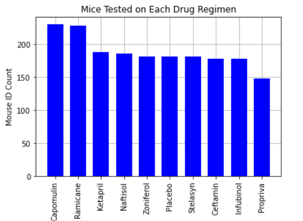
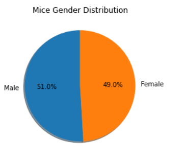
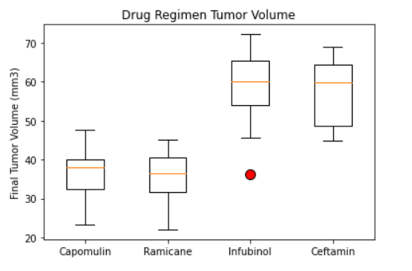

# Matplotlib-Pharmaceutical study

## Background

This project uses data from a recent animal study. In this study, 249 mice identified with SCC tumor growth were treated through a variety of drug regimens. Over the course of 45 days, tumor development was observed and measured. The purpose of this study was to compare the performance of Pymaceuticals' drug of interest, Capomulin, versus the other treatment regimens. The project objective is to generate all of the tables and figures needed for the technical report of the study. Including a top-level summary of the study results.

## Steps for cleaning and preparing the data and completing the analysis:

* Before beginning the analysis, the data was checked for any mouse ID with duplicate time points and and data associated with that mouse ID was removed.

* Generated a summary statistics table consisting of the mean, median, variance, standard deviation, and SEM of the tumor volume for each drug regimen.

* Generated a bar plot using both Pandas's `DataFrame.plot()` and Matplotlib's `pyplot` that shows  the number of total mice for each treatment regimen throughout the course of the study.

* Generated a pie plot using both Pandas's `DataFrame.plot()` and Matplotlib's `pyplot` that shows the distribution of female or male mice in the study.

* Calculated the final tumor volume of each mouse across four of the most promising treatment regimens: Capomulin, Ramicane, Infubinol, and Ceftamin. Calculated the quartiles and IQR and quantitatively determine if there are any potential outliers across all four treatment regimens.

* Using Matplotlib, generated a box and whisker plot of the final tumor volume for all four treatment regimens and highlight any potential outliers in the plot by changing their color and style.

* Selected a mouse that was treated with Capomulin and generated a line plot of tumor volume vs. time point for that mouse.

* Generated a scatter plot of mouse weight versus average tumor volume for the Capomulin treatment regimen.

* Calculated the correlation coefficient and linear regression model between mouse weight and average tumor volume for the Capomulin treatment. Ploted the linear regression model on top of the previous scatter plot.

## Running the python script

The Python script can be executed using Jupyter lab or Colab by loading the Mouse_metadata.csv and Study_results.csv data files and running the script.

## File Structure

Images Folder - Includes png files created from the python script and used in the Readme.
Instructions Folder - Includes the Jupyter Notebook file with the python script.
    Data Subfolder - Includes the data in csv files and loaded to run the script.
README.md File - Project summary and information

